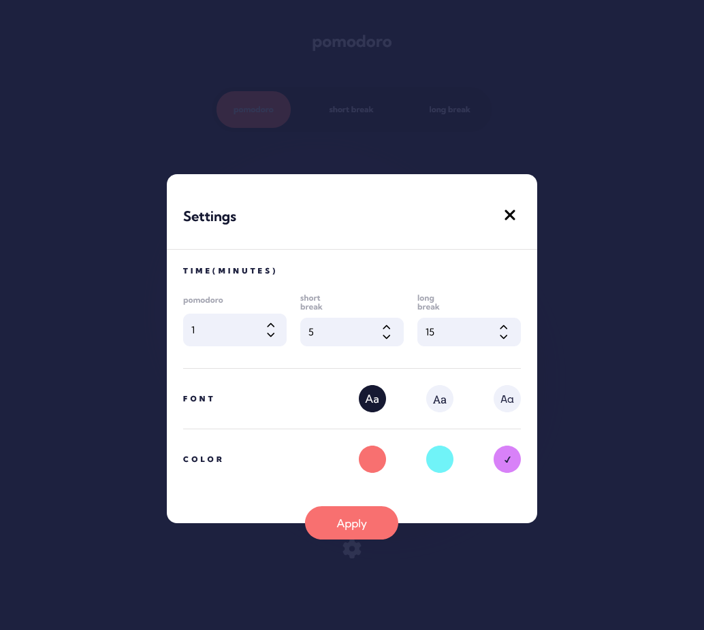
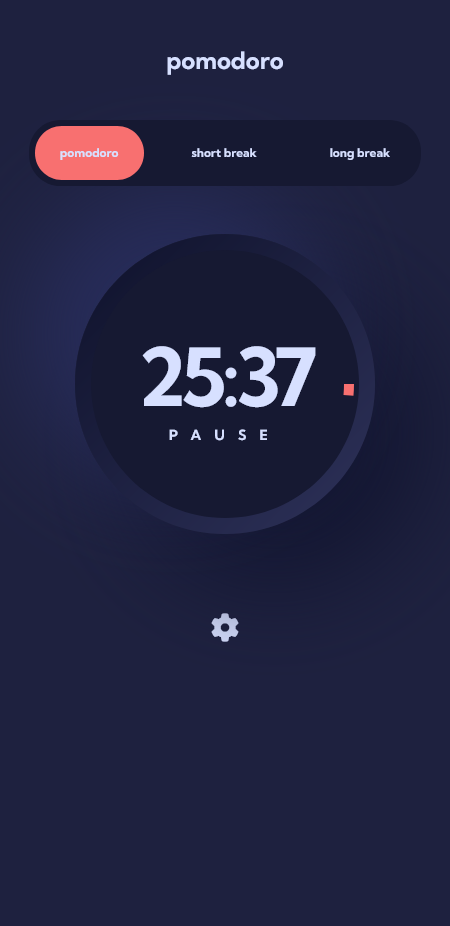

# Pomodoro app

This application was built as a solution to the [Pomodoro app challenge on Frontend Mentor](https://www.frontendmentor.io/challenges/pomodoro-app-KBFnycJ6G).

## Table of contents

-   [Overview](#overview)
    -   [The challenge](#the-challenge)
    -   [Screenshot](#screenshot)
    -   [Links](#links)
-   [My process](#my-process)
    -   [Built with](#built-with)
    -   [Useful resources](#useful-resources)
-   [Author](#author)

## Overview

### Description

The Pomodoro app allows users to set a pomodoro timer, a short break timer and a long break timer. They are also able to see how far along the timer has run through a circular progress bar. Users are also able to configure some colors and the font family.

### Screenshot

-   
-   

### Links

-   Solution URL: [Github](https://github.com/joeehis1/pomodoro-app)
-   Live Site URL: [Site](https://pomo-interval.netlify.app/)

## My process

### Built with

-   [SCSS](htts://https://sass-lang.com/)
-   [React](https://reactjs.org/)
-   [Typescript](https://www.typescriptlang.org/)

### Useful resources

-   [Focus Management and Inert](https://css-tricks.com/focus-management-and-inert/) - This articles contains tips for trapping focus within an element. This is useful for keyboard accessibility
-   [Making Modals Accessible](https://www.smashingmagazine.com/2014/09/making-modal-windows-better-for-everyone/) - This article provides helpful tip for making modals accessible

## Author

-   Website - [Ehisuoria Joseph Ehigiator](https://ehis-portfolio.netlify.app/)
-   Linkedin - [Linkedin Profile](www.linkedin.com/in/ehisuoria-joseph-ehigiator-45a970296)
